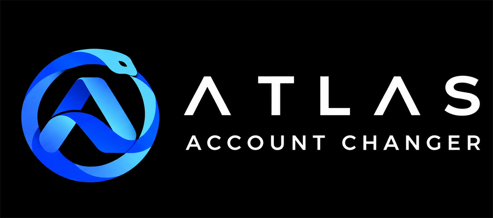

  
  
<strong>Your Steam accounts. Your layout.</strong>

  
V1.0.2 · Windows 64-bit

  
<a href="https://github.com/BluelineDE/atlas-account-changer/releases/latest"><strong>Download Atlas →</strong></a> · <a href="https://github.com/BluelineDE/atlas-account-changer/issues">Report a bug</a>

---

## Your accounts, organised

Atlas Account Changer brings your Steam accounts into one customisable workspace.

- Organise accounts with groups, favorites, search and sorting.
- Personalise your tiles, colours and layouts.
- Choose a solid appearance or enable Atlas Glass.
- Keep notes in editable tables with separate screenshot columns.
- Reuse your designs with templates.

## Download and install

1. Download the installer from the [latest release](https://github.com/BluelineDE/atlas-account-changer/releases/latest).
2. Close Atlas if it is already running.
3. Open the installer, choose an installation folder and install.

Updating or reinstalling keeps your existing accounts and settings. No separate runtime installation is required.

## Windows SmartScreen

Windows may display **“Windows protected your PC”** or **“Unknown publisher”**. This release is **unsigned**, so Windows cannot verify its publisher through a trusted code-signing certificate. New unsigned files may also have little or no SmartScreen reputation. This warning alone is not a malware detection. [Learn more from Microsoft](https://learn.microsoft.com/en-us/windows/apps/package-and-deploy/smartscreen-reputation).

Download Atlas from this repository's official Releases.

## Updates

Atlas checks GitHub for a newer stable release every time it starts. When an update is available, an indicator appears in the top bar. Click it to open the new release on GitHub.

## Feedback

Found a problem? [Report a bug](https://github.com/BluelineDE/atlas-account-changer/issues) with your Atlas version and the steps to reproduce it. Remove account names, login details and private screenshots before attaching images.

---

Atlas is an independent application and is not endorsed by Valve. Steam and the Steam logo are trademarks of Valve. Third-party notices are included with the installer.
